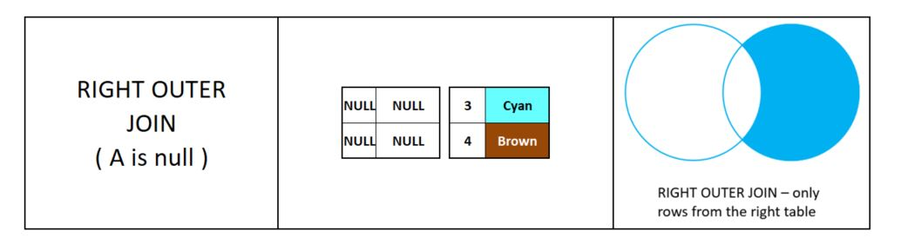

# Join Yöntemleri


#### 

#### 

#### INNER JOIN 


```sql
SELECT a.id id_a, a.color color_a,
       b.id id_b, b.color color_b
FROM palette_a a
INNER JOIN palette_b b ON a.color = b.color;```sql

```

## 

#### LEFT JOIN \(LEFT OUTER JOIN\) 


```sql
SELECT a.id id_a, a.color color_a,
       b.id id_b, b.color color_b
FROM palette_a a
LEFT JOIN palette_b b ON a.color = b.color;
--WHERE b.id IS NULL; 
```


## RIGHT JOIN \(RIGHT OUTER JOIN\)


```sql
SELECT a.id id_a, a.color color_a,
       b.id id_b, b.color color_b
FROM palette_a a
RIGHT JOIN palette_b b ON a.color = b.color;
--WHERE a.id IS NULL;
```




## FULL JOIN \(FULL AUTER JOIN\) 


```sql
SELECT a.id id_a, a.color color_a,
       b.id id_b, b.color color_b
FROM palette_a a
FULL OUTER JOIN palette_b b ON a.color = b.color;
--WHERE a.id IS NULL OR b.id IS NULL;
```


#### 

## CROSS JOIN


```sql
SELECT a.id id_a, a.color color_a,
       b.id id_b, b.color color_b
FROM palette_a a
CROSS JOIN palette_b b;
```

#### 

## SELF JOIN 

```sql
SELECT
    (e.first_name || '  ' || e.last_name) employee,
    (m.first_name || '  ' || m.last_name) manager,
    e.job_title
FROM employees e
LEFT JOIN employees m ON
    m.employee_id = e.manager_id
ORDER BY manager;
```


> **USING Kullanımı :** Join kuralında, gereksiz kopyalanan sütunlar olmadan daha kısa ve net sonuç almak için kullanılır. USING ile yapılan JOIN lerde, JOIN kuralında kullanılan alanlar, SELECT de yada WHERE kriterlerinde kullanılamaz. USING kullanılarak JOIN yapılırken tek kolon adı kullanılır, dolayısıyla her iki tablonun da JOIN lenecek kolon isimlerinin aynı olması gerekir. Kodlama standartlarını da desteklemesi amaçlı bu formatta yazmak tercih edilebilir.

```sql
SELECT E.ENAME, D.DNAME
FROM EMP E JOIN DEPT D USING (DEPTNO);
-- Her iki sorgu aynı sonucu döndürür
SELECT E.ENAME, D.DNAME
FROM EMP E JOIN DEPT D ON D.DEPTNO = E.DEPTNO;
-- DEPNO alanı JOIN de kullanılan alandır.
-- Bu alan SELECT yada WHERE kriterlerinde kullanılamaz. ```sql

```


#### RIGHT JOIN \(RIGHT OUTER JOIN\) 

```sql

```

#### 

#### FULL JOIN \(FULL AUTER JOIN\) 

```sql

```

#### 

#### SELF JOIN 

```sql

```


#### INNER SELECT

```sql

```


<!--stackedit_data:
eyJoaXN0b3J5IjpbMjMwOTAwOTE4XX0=
-->